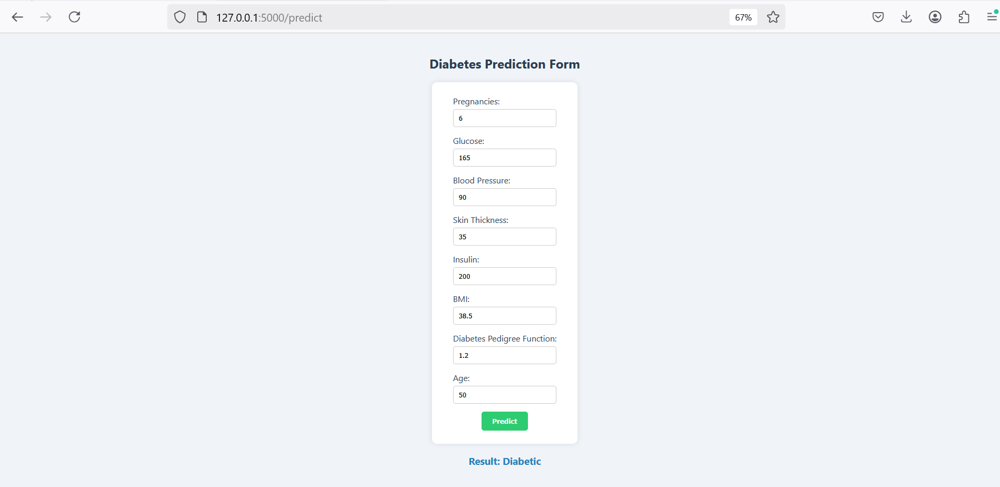

# 🧠 Health Risk Prediction: Diabetes  

## Project Description  
This project focuses on predicting the likelihood of **diabetes** in patients using the **Pima Indians Diabetes Dataset**. It covers the complete data science pipeline, from data preprocessing and model training to deploying the prediction model through two different web applications:  

1. 🌐 **Flask Web App with HTML/CSS UI**  
2. 📊 **Streamlit Web App**  

## Dataset  
- **Name**: Pima Indians Diabetes Dataset  
- **Source**: UCI Machine Learning Repository / Kaggle  
- **Features**:  
  - Pregnancies, Glucose, Blood Pressure, Skin Thickness, Insulin, BMI, Diabetes Pedigree Function, Age  
- **Target**: `Outcome` (0 = No Diabetes, 1 = Diabetes)  

## Features Implemented  
- **Data Preprocessing**:  
  - Handled zero or missing values  
  - Feature scaling using StandardScaler  
- **Model Training**:  
  - Logistic Regression   
  - Model evaluation using accuracy.  
- **Deployment Options**:  
  - **Flask App**: Built with a custom HTML/CSS front-end for input and results display  
  - **Streamlit App**: Interactive and easy-to-use UI   

## Technology Stack  
- **Python**  
- **Pandas, NumPy, Scikit-Learn**  
- **Flask, HTML/CSS**  
- **Streamlit**  

## 🖼️ Demo Screenshot

