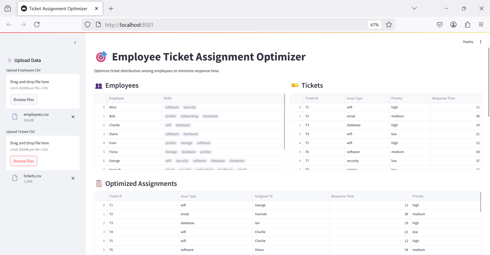

# 🎯 Employee Ticket Assignment Optimizer

A smart system to optimize the assignment of support tickets to employees based on their skills and availability. This project helps minimize response time, improve workload balance, and increase operational efficiency .

## 🛠️ Built With

- **Python**
- **Streamlit** – for the interactive web dashboard
- **PuLP** – for optimization using Linear Programming
- **Pandas** – for data processing
- **Matplotlib** & **Seaborn** – for beautiful visualizations

## 📂 How It Works

1. **Upload Employee and Ticket CSVs**
   - Employee data includes skills.
   - Ticket data includes issue type, priority, and response time.

2. **Optimization Model**
   - Tickets are assigned to employees based on skill match.
   - The model ensures balanced workload.
   - It minimizes priority-weighted response time.

3. **Dashboard Visuals**
   - View employee workloads.
   - See ticket assignments.

## 🚀 Features
- 🔁 Upload your own employee and ticket CSVs
- 📋 Automatically optimized ticket assignments
- 📊 Workload distribution per employee

## 📸 Screenshot

